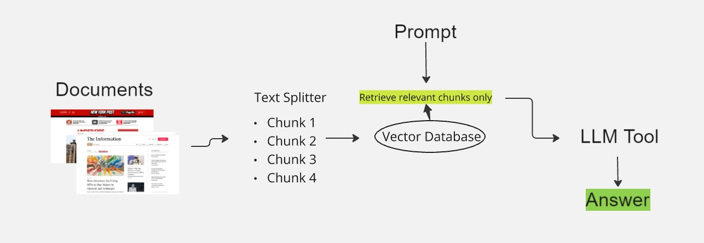

# 📰 News Research Tool


Welcome to the **News Research Tool** – a powerful application that makes news research smarter and faster! This tool extracts, processes, and summarizes news articles to help you save time and get the information you need more efficiently.


1. [Key Features](#-key-features)
2. [Why Use the News Research Tool?](#-why-use-the-news-research-tool)
3. [Project Structure](#project-structure)
4. [Technical Blueprint](#technical-blueprint)
5. [Steps Overview](#steps-overview)
6. [Future Enhancements](#future-enhancements)


## 🚀 Key Features
- **🌐 URL-Based Content Extraction:** Input up to three URLs, and the tool fetches and processes news content for you.
- **⚡ AI-Powered Q&A:** Ask questions about the processed content and get concise AI-generated answers.
- **🔍 Smart Information Retrieval:** Uses advanced vector-based document retrieval with FAISS for accurate results.
- **📄 Source Transparency:** Displays the original sources for all retrieved information, so you can verify the details.

## 🌟 Why Use the News Research Tool?

While LLMs like ChatGPT offer powerful natural language processing capabilities, they aren't always ideal for research that requires accurate, real-time information retrieval. Here’s why this tool stands out:

### 🔍 Limitations of directly employing ChatGPT and other LLMs
1. **Static Knowledge Base**:
   - ChatGPT and similar LLMs are trained on a static dataset, meaning they cannot access up-to-the-minute information or data published after their last training cut-off. In contrast, news research often demands real-time information retrieval from current articles and web sources.

2. **Computational Expense and Cost Escalation**:
    - Due to low token size, efficient query matching and optimized resource usage.
   
2. **Context Limitations**:
   - LLMs like ChatGPT struggle with very long documents, often missing out on important context. The News Research Tool addresses this by breaking articles into manageable chunks, allowing more accurate and relevant responses.
   
3. **Source Attribution**:
   - ChatGPT does not provide original source links for the information it generates. For research purposes, the ability to verify information through reliable sources is crucial.
   
4. **Domain-Specific Information Retrieval**:
   - General-purpose LLMs can sometimes produce responses that are too broad or lack domain-specific insights. The News Research Tool uses vector-based document retrieval (FAISS indexing) to match user queries with the most relevant parts of specific news articles.

### 🚀 Advantages of the News Research Tool
- **Dynamic Content Access**: Fetches data directly from news URLs, allowing for the latest information to be processed and summarized.
- **Enhanced Relevance**: Uses document splitting and embedding techniques to ensure that the most pertinent content is retrieved and presented.
- **Trustworthy Outputs**: Displays original sources, enabling users to trace the information back to its origin and evaluate the credibility.

This bridges the gap by combining LLM-based text generation with real-time content extraction and AI-powered document retrieval.

## Project Structure
- **main.py**: Main Streamlit application script.
- **requirements.txt**: A list of required Python packages for the project.
- **vector_index.pkl**: A pickle file to store the FAISS index.
- **Research**: Test pipelines and other documents

## Technical Blueprint



## Steps Overview
### 1. Streamlit App Initialization

- Initializes the app with a title and sidebar for user inputs.
- Accepts up to three news article URLs and includes a button to start processing.
- Inititalizes file_path to pickle file, to be used later upon data ingestion.

```python

st.title("News Research Tool")

st.sidebar.title("News Research URLs")

urls = []
for i in range(3):
    url = st.sidebar.text_input(f"URL{i+1}")
    urls.append(url)

process_url_clicked = st.sidebar.button("Process links")
file_path = "vector_index.pkl"

main_placeholder = st.empty()
```

### 2. Configuring the Language Model

- I used Hugging face text generation model instead of OpenAI due to costs effectiveness.

```python
repo_id = "google/flan-t5-small"
task = "text2text-generation"
llm = HuggingFaceHub(repo_id=repo_id, task=task, model_kwargs={"temperature": 0.9, "max_length": 100})
```

### 3. Processing URLs for Content Extraction

- I used ***UnstructuredURLLoader*** class instance with the list of URLs provided by the user. This can handle unstructured data as well i.e. extracting relevant text from various types of webpages like HTML, PDFs etc.
- ***main_placeholder.text*** is used to generate visual feedback to user on background information, important for user experience.

```python
if process_url_clicked:
    if urls:  
        loader = UnstructuredURLLoader(urls=urls)
        main_placeholder.text("Data Loading...Started ✅✅✅")
        data = loader.load()
```

### 4. Data Assessments

- Check if data is loaded correctly

```python
        if not data:
            main_placeholder.text("No data loaded from the provided URLs.")
        else:
            # Add source metadata to each document
            docs = [Document(page_content=doc.page_content, metadata={"source": url}) for url, doc in zip(urls, data)]
```
- Split data into chunks 
- Idea is to separate data based on relevant separators and overlaps for efficient storage and future search optimisation.
```python
            # Split data
            text_splitter = RecursiveCharacterTextSplitter(
                separators=['\n\n', '\n', '.', ' '],
                chunk_size=1000,
            )
            main_placeholder.text("Text Splitter...Started ✅✅✅")
            split_docs = text_splitter.split_documents(docs)
```

### 5. Embedding data and creating vector_index using FAISS
- Creates vector embeddings using sentence transformers for efficient retrieval.
- The vector index is saved for future use, ensuring fast response times.
```python
            embedding_model_name = "sentence-transformers/paraphrase-MiniLM-L3-v2"
            embeddings = HuggingFaceEmbeddings(model_name=embedding_model_name)
            main_placeholder.text("Creating FAISS index... ✅")
            vectorstore = FAISS.from_documents(split_docs, embeddings)

            with open(file_path, 'wb') as f:
                pickle.dump(vectorstore, f)
            main_placeholder.text("Vector index created and saved ✅")
```
### 6. Query Handling and Response Generation
- User queries are checked for token limits to optimize performance.
- Ensures that responses are relevant to the user's questions with semantic search.

```python
query = main_placeholder.text_input("Question: ")
if query:
    # Check if input exceeds token limits
    input_tokens = len(query.split())

    # Adjust max_new_tokens as necessary
    if input_tokens + 100 > 1024:  
        st.warning("Input too long. Please shorten your question.")
    else:
        if os.path.exists(file_path):
            with open(file_path, "rb") as f:
                vectorstore = pickle.load(f)
                chain = RetrievalQAWithSourcesChain.from_llm(llm=llm, retriever=vectorstore.as_retriever())
                result = chain({"question": query}, return_only_outputs=True)
```
### 7. Display answer with sources 

- After parsing through the Hugging Face LLM, the streamlit command retrieves the summarized result.
- Also displays relevant source and links to confirm authenticity.
```python
              st.header("Answer")
                st.write(result["answer"])

                # Display sources, if available
                sources = result.get("sources", [])
                if sources:
                    st.subheader("Sources:")
                    sources_list = sources.split("\n")  # Split the sources by newline
                    for source in sources_list:
                        st.write(source)
```
## Future Enhancements

1. **Dynamic Web Scraping**: Implement techniques like rotating proxies and user-agent spoofing to evade anti-scraping measures and ensure consistent access to news sources.

2. **Cost Optimization**: Utilize serverless architectures, such as AWS Lambda, to dynamically scale processing power, minimizing costs during low-demand periods.

3. **Data Integrity Checks**: Integrate automated validation mechanisms to cross-reference scraped content with trusted sources, ensuring accuracy and reliability.

4. **Adaptive Retrieval Models**: Develop machine learning models that learn from user interactions to refine content retrieval and summarization based on user preferences.

